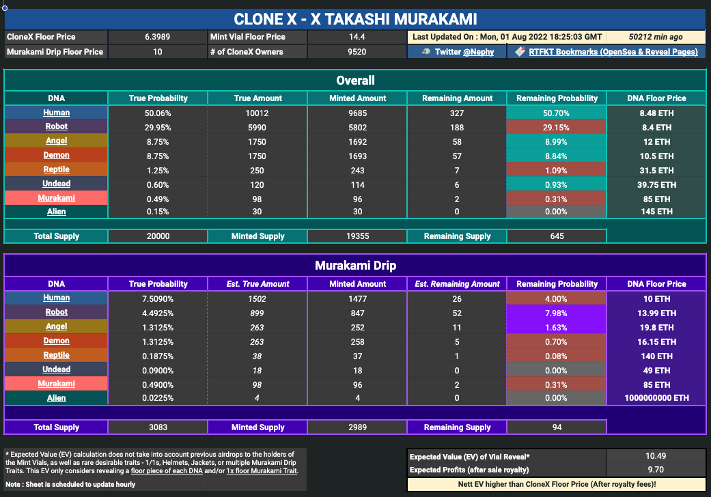
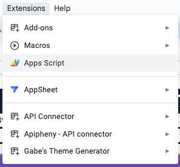
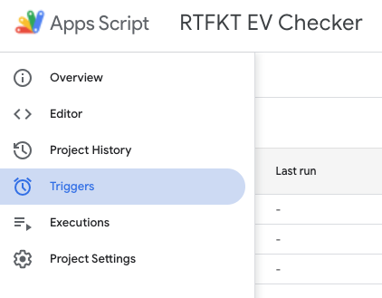
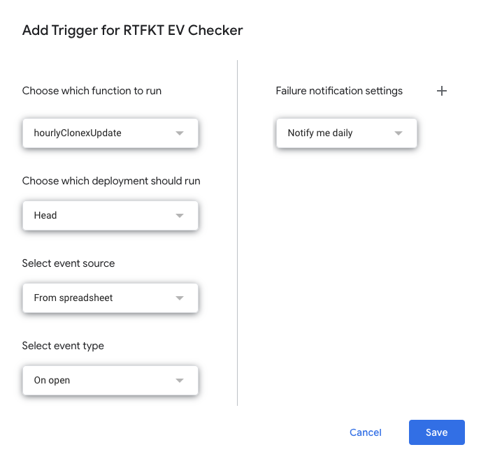

> This project has been outdated & not been maintained since 01 Aug 2022. OpenSea may have since updated their API endpoint - do check [OpenSea developers documentation](https://docs.opensea.io/) for latest updates

# NFT Price & Reveal Expected Value Analytics

## Overview
`rtfkt-price-stats` is designed to gather & analyze statistics on the RTFKT [CloneX](https://opensea.io/collection/clonex) Non-Fungible Tokens (NFTs) from the [OpenSea NFT Marketplace](https://opensea.io/).

This project was created by utilising:

*  OpenSea Marketplace API
*  Google Firebase Function
*  Google Apps Script & Scheduler
*  Google Sheets

#### Screenshot of Google Sheets Data output

🔗 [Open Google Sheet](https://docs.google.com/spreadsheets/d/1tGINKj_7WAxzGtTDWcfPwEcb5M3ww12zQAxvrHQ68Fg/view?usp=sharing)

## Motivation

Provide users with the value & trends of the NFT collection, specirically focusing on the unrevealed rare NFTs. This information was valuable for users interested in estimating the EV of opening an unrevealed NFT (similar to blind boxes) to acquire rare NFTs.

## Get Started

1. Setup Firebase: Setup a Firebase project & deploy Firebase Functions from the `functions` folder

2. Create / open an existing Google Sheet 

3. From the Google Sheets Menu, open Extensions > Apps Script
 
    

4. Paste in the code from the `appscript` folder

5. On the left menu, click on Triggers, add a Trigger, and schedule functions to run repeatedly

    

5. Click on Add Trigger, and schedule functions to run repeatedly

    

---